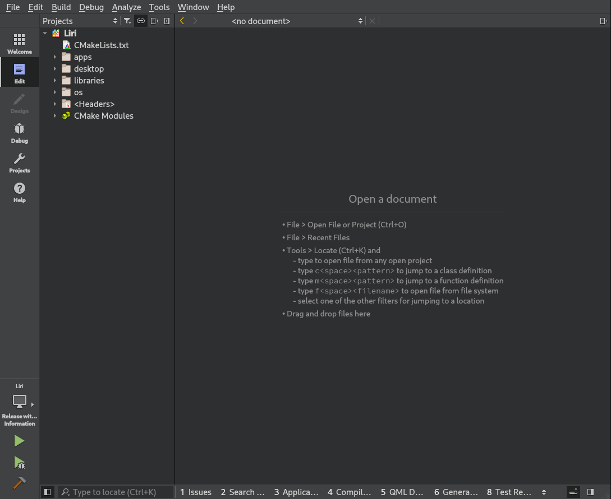
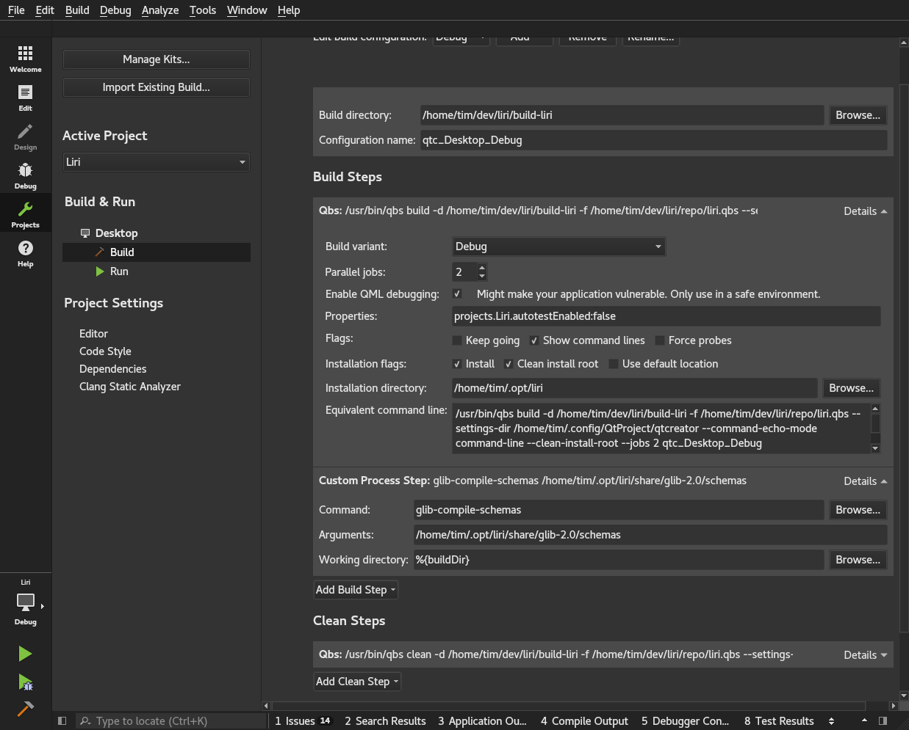
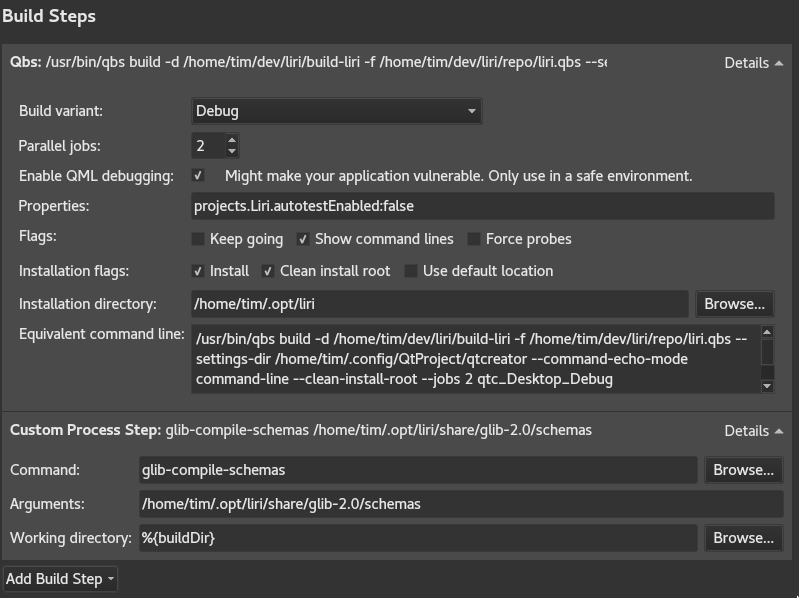
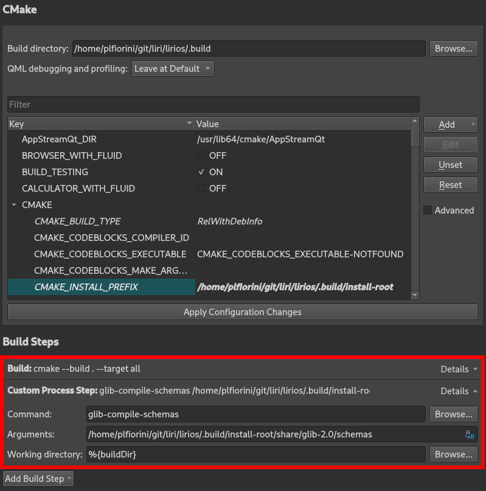

With Google's [repo](https://source.android.com/source/using-repo) command you can download all the projects at once and open them from QtCreator.

## Prerequisites

In this guide we assume that you are using the `bash` shell and QtCreator 4.3.0 or greater.

## Download sources and prepare for the development

### Install repo

Your Linux distribution might have `repo` available, check in their repositories.

We know Arch Linux has got the package, if you are using it just:

```sh
sudo pacman -S repo
```

If you are using another distribution and it doesn't have a package available, follow these instructions:

Create ~/bin/ subdirectory, include it in PATH, and then switch to it by executing the following commands:

```sh
mkdir ~/bin/
PATH=~/bin:$PATH
```

Download the repo script by executing the following command:

```sh
curl http://commondatastorage.googleapis.com/git-repo-downloads/repo > ~/bin/repo
```

Change the attribute of repo to make it executable by executing the command:

```sh
chmod a+x ~/bin/repo
```

### Clone the repositories

To clone the latest source of all projects over SSH, perform the following procedure:

Firstly, create a new directory for Liri. This will be referred to as repo root in the docs. Switch to it by executing the following commands:

```sh
mkdir ~/lirios
cd ~/lirios
```

Initialize the repository by executing one of the following commands, as appropriate.

For [write access](https://help.github.com/articles/access-permissions-on-github/):

```sh
repo init -u ssh://git@github.com/lirios/lirios.git -b develop
```

For read-only access:

```sh
repo init -u https://github.com/lirios/lirios.git -b develop
```

Synchronize the repository by executing the following command:

```sh
repo sync
```

### Get ready for development

`repo` doesn't create local branches for you, hence you end up with a
detached head that points to the last known good commit.

Before you start developing make sure you have local branches:

```sh
repo forall -c 'git checkout $REPO_RREV; git submodule update --init --recursive'
```

Now set git to use the commit template that will help you write
good commit messages:

```sh
ROOTDIR=$(pwd) repo forall -c 'git config commit.template $ROOTDIR/.commit-template'
```

## Setup the environment

The installation root is the directory where all files will be installed when building the Liri master project from QtCreator.

To set your environment variables correctly so you will be able to launch the cross platform apps, run

```sh
source env-setup.sh [configuration-name] [nvidia]
```

**Note** for users running the Nvidia proprietary drivers: Supply the `nvidia` argument every time you run the env-setup.sh script

By default, `.build` inside your repo root will be used as installation root. To change this, issue the command with the LIRIDIR prefix instead

```sh
LIRIDIR="path/to/directory" source env-setup.sh [nvidia]
```

## Open the project

Run `QtCreator` and open the master project file `liri.qbs` inside your repo root.



Click on the "Projects" button and setup the build, this needs to be done only the first time.



Set the build directory to whatever you want, just make sure you have access to the directory:


Make sure the build steps are configured like in this screenshot:



Especially the installation root:


Remember to replace `/home/tim` to your actual home directory.

If you don't want to run all the unit tests during the build leave `projects.Liri.autotestEnabled:false` in the "Properties" field like in the screenshots, otherwise set it to `projects.Liri.autotestEnabled:true`.

Now create a custom build step like this:



The custom build step will compile the settings schemas so it must be there.

## Update sources

New repositories might be added to the manifest or new commits are pushed to existing repositories, so from time to time you need to fetch updated versions.

Make sure all your changes are either committed or stashed and run:

```sh
cd ~/lirios
repo sync
```

Now set git to use the commit template that will help you write
good commit messages:

```sh
ROOTDIR=$(pwd) repo forall -c 'git config commit.template $ROOTDIR/.commit-template'
```
