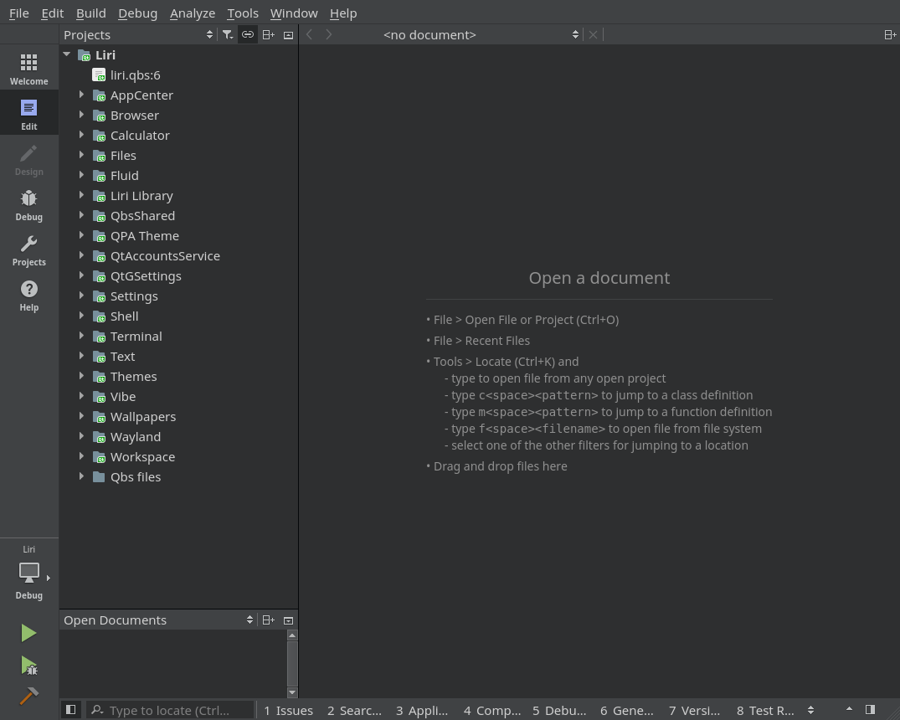
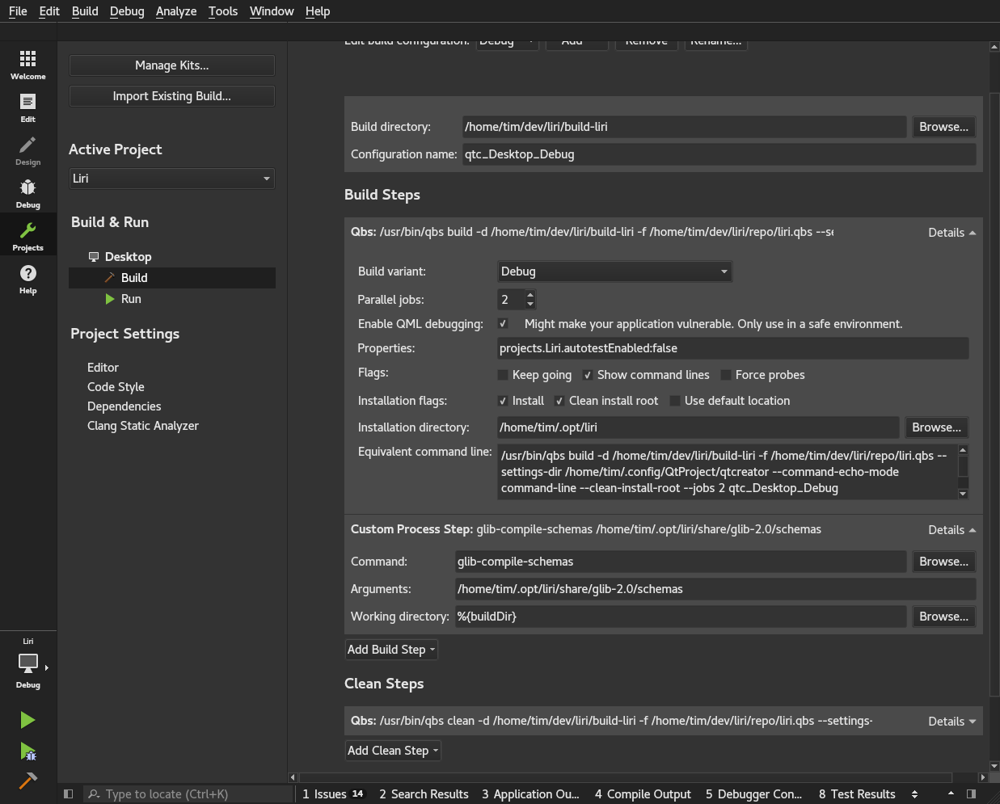
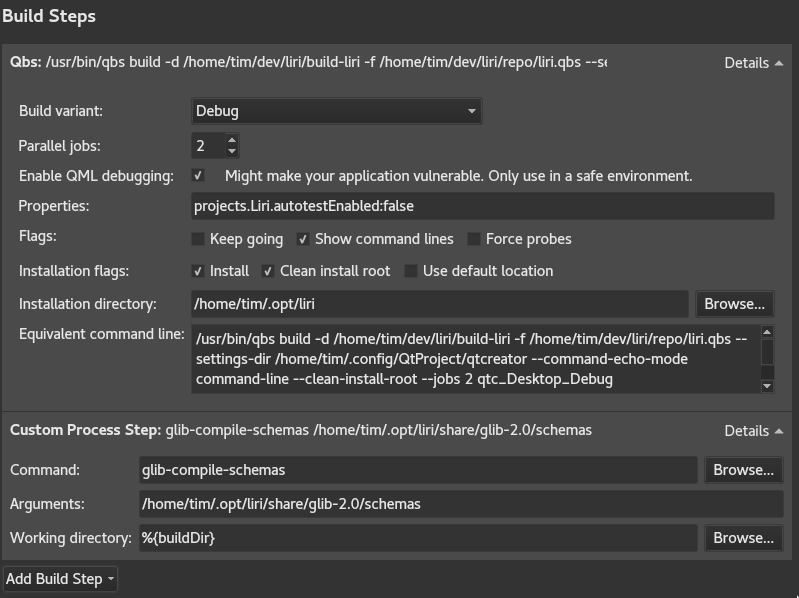
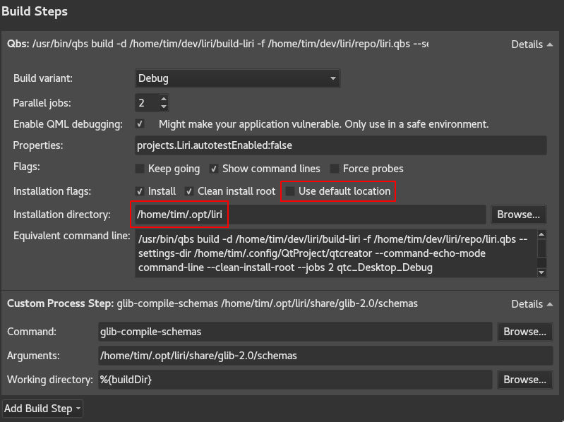
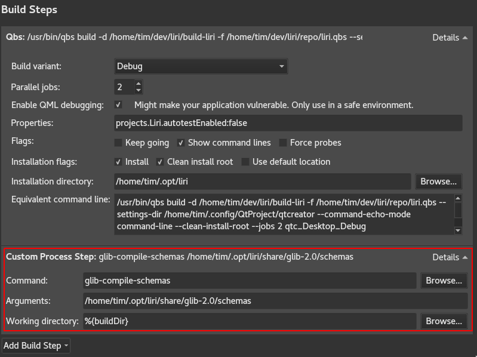

Liri apps and libraries are built using [Qt](https://www.qt.io/).

The IDE of choice is [QtCreator](https://www.qt.io/ide/) a cross-platform IDE dedicated to development with Qt.

All projects use the Qbs build system, a new build system that is much easier to use compared to qmake or CMake.
If you want to learn more, please read the [Qbs manual](http://doc.qt.io/qbs/index.html),
especially the [setup guide](http://doc.qt.io/qbs/configuring.html) and how to install artifacts
from the [installation guide](http://doc.qt.io/qbs/installing-files.html).

Source code is managed with [git](https://git-scm.com/) and we use the [git flow](http://nvie.com/posts/a-successful-git-branching-model/) workflow. This means, in a nutshell, that the latest released code is in the `master` branch while development happens in the `develop` branch.

With Google's [repo](https://source.android.com/source/using-repo) command you can download all the projects at once and open them from QtCreator.

## Prerequisites

In this guide we assume that you are using the `bash` shell and QtCreator 4.3.0 or greater.

## Download sources and prepare for the development

### Install repo

Your Linux distribution might have `repo` available, check in their repositories.

We know Arch Linux has got the package, if you are using it just:

```sh
sudo pacman -S repo
```

If you are using another distribution and it doesn't have a package available, follow these instructions:

1. Create ~/bin/ subdirectory, include it in PATH, and then switch to it by executing the following commands:

```sh
mkdir ~/bin/
PATH=~/bin:$PATH
```

2. Download the repo script by executing the following command:

```sh
curl http://commondatastorage.googleapis.com/git-repo-downloads/repo > ~/bin/repo
```

3. Change the attribute of repo to make it executable by executing the command:

```sh
chmod a+x ~/bin/repo
```

Now create a new directory for Liri and then switch to it by executing the following commands:

```sh
mkdir ~/lirios
cd ~/lirios
```

### Clone the repositories

To clone the latest source of all projects over SSH, perform the following procedure:

1. Initialize the repository by executing one of the following commands, as appropriate.

For developer access:

```sh
repo init -u ssh://git@github.com/lirios/lirios.git -b develop
```

For read-only access:

```sh
repo init -u https://github.com/lirios/lirios.git -b develop
```

2. Synchronize the repository by executing the following command:

```sh
repo sync
```

### Get ready for development

`repo` doesn't create local branches for you, hence you end up with a
detached head that points to the last known good commit.

Before you start developing make sure you have local branches:

```sh
repo forall -c 'git checkout $REPO_RREV'
repo forall -c 'git submodule update --init --recursive'
```

Now set git to use the commit template that will help you write
good commit messages:

```sh
ROOTDIR=$(pwd) repo forall -c 'git config commit.template $ROOTDIR/.commit-template'
```

## Setup the environment

Create the installation root:

```sh
mkdir -p ~/.opt/liri
```

The installation root is the directory where all files will be installed when building the Liri master project from QtCreator.

Create a file with environment variables in case you want to run any Liri program from the terminal.
Run your favorite text editor, write the following text and save it as `~/lenv`:

```sh
LIRIDIR=~/.opt/liri

export LD_LIBRARY_PATH=$LIRIDIR/lib:$LD_LIBRARY_PATH
export XDG_DATA_DIRS=$LIRIDIR/share:/usr/local/share:/usr/share:~/.local/share:~/.local/share/flatpak/exports/share
export XDG_CONFIG_DIRS=$LIRIDIR/etc/xdg:/etc/xdg
export QT_PLUGIN_PATH=$LIRIDIR/lib/plugins
export QML2_IMPORT_PATH=$LIRIDIR/lib/qml:$QML2_IMPORT_PATH
export PKG_CONFIG_PATH=$LIRIDIR/lib/pkgconfig:$PKG_CONFIG_PATH
export PATH=$LIRIDIR/bin:$PATH
#export QT_XCB_GL_INTEGRATION=xcb_egl  # uncomment this if you are not using the NVIDIA proprietary driver
```

Every time you open a new terminal and want to run a Liri program you need to set the environment variables with:

```sh
source ~/lenv
```

## Open the project

Run `QtCreator` and open the master project file `~/lirios/lirios.qbs`.



Click on the "Projects" button and setup the build, this needs to be done only the first time.



Set the build directory to whatever you want, just make sure you have access to the directory:


Make sure the build steps are configured like in this screenshot:



Especially the installation root:



Remember to replace `/home/tim` to your actual home directory.

If you don't want to run all the unit tests during the build leave `projects.Liri.autotestEnabled:false` in the "Properties" field like in the screenshots, otherwise set it to `projects.Liri.autotestEnabled:true`.

Now create a custom build step like this:



The custom build step will compile the settings schemas so it must be there.

## Update sources

New repositories might be added to the manifest or new commits are pushed to existing repositories, so from time to time you need to fetch updated versions.

Make sure all your changes are either committed or stashed and run:

```sh
cd ~/lirios
repo sync
```

Make sure the branch is checked out and all submodules are updated:

```sh
repo forall -c 'git checkout $REPO_RREV'
repo forall -c 'git submodule update --init --recursive'
```

Now set git to use the commit template that will help you write
good commit messages:

```sh
ROOTDIR=$(pwd) repo forall -c 'git config commit.template $ROOTDIR/.commit-template'
```
